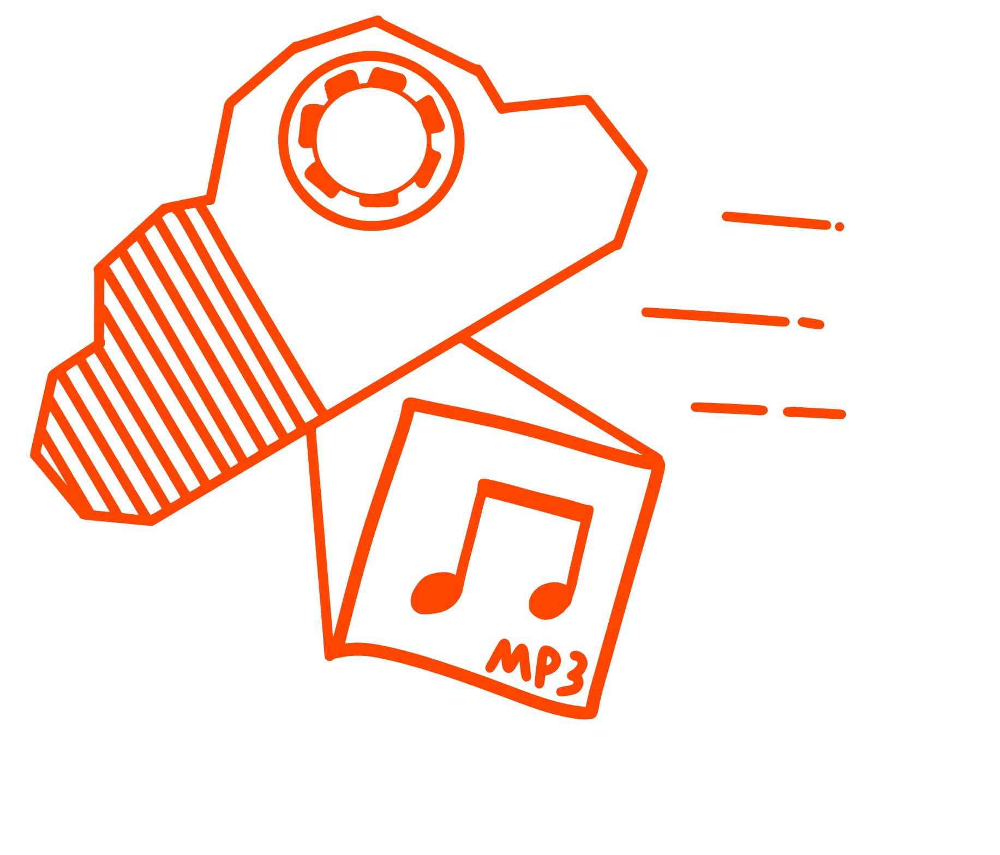

<div align="center">

  

</div>

## Personal software, expect sweeping changes with no migration pipelines

# SCSuck

#### Sucks down songs so you dont have to!

SCSuck is a SoundCloud library downloader that helps you automatically download your entire SoundCloud music collection. Think of it like [Deemon](https://github.com/digitalec/deemon) but for soundcloud.

This tool lets you plug in an artist name and bulk download everything they've produced, it adds them to a database so that you can download new songs from every artist you've collected with a single command without needing to manually enter names, all with with proper metadata and album artwork. Perfect for backing up your SoundCloud following lists, and artist collections.

\> scsuck <br> \> look inside <br> \> sucks

This program was made for linux and may get hung up on crazy filenames on other OS's <br> probably? maybe? I havent tested it

# Requirements

[Bun](https://bun.sh) is the runtime, `ffmpeg` must be accessable via CLI, and a PostgreSQL server holds the library database (`pg_dump` is used for backups).

For debian based systems:

```BASH
sudo apt install ffmpeg postgresql-client
curl -fsSL https://bun.sh/install | bash
```

You must provide a soundcloud user api key and put it in `.env` (see `.env.example`)

From: [Soundcloud.ts](https://github.com/Moebits/soundcloud.ts):

> Soundcloud has closed down their API applications, but you are still able to get your client id and oauth token by inspecting the network traffic.
>
> -   Go to soundcloud.com and login (skip if you are already logged in)
> -   Open up the dev tools (Right click -> inspect) and go to the Network tab
> -   Go to soundcloud.com, and you should see a bunch of requests in the network tab
> -   Find the request that has the name `session` (you can filter by typing `session` in the filter box) and click on it
> -   Go to the Payload tab
> -   You should see your client id in the Query String Parameters section, and your oauth token (`access_token`) in the Request Payload section

# How to use

```BASH
git clone https://github.com/PixelMelt/SCSuck
cd SCSuck
bun install
cp .env.example .env
*edit .env*
bun src/index.ts --help
```

Useful commands:

```BASH
bun src/index.ts -a <artist url/id>   # add an artist
bun src/index.ts -r                   # discover + download for all monitored artists
bun src/index.ts --run                # full cycle: backup if due, config artists, followers, refresh
bun src/index.ts --backup             # back up the database now
bun test                              # run the unit tests
bunx tsc --noEmit                     # typecheck
```

Downloads run per artist: each artist is discovered and downloaded immediately before moving to the next, so freshly issued download URLs are used right away (DataDome is watching).

Runs resume: an artist only counts as "checked" after a clean discover+download cycle, and artists checked within the last `SCS_DISCOVERY_INTERVAL` hours (default 6, 0 disables) are skipped — so rerunning after an interruption continues where it stopped instead of re-crawling everyone. `-r <artist>` always forces a refresh.

# Application Roadmap

## Main Project Goals

Automatically manage downloading SC artists and have full compatability with navidrome

## Backend

-   ✅ Docker image (Bun-based, with ffmpeg + pg_dump)
-   ✅ Backup database at specified intervals (`SCS_BACKUP_INTERVAL` hours, checked each run; manual `--backup`)
-   ✅ Specifiy a library update interval (external scheduling: Ofelia in docker-compose via the `ofelia.job-run.weekly-collect.schedule` label, or your own cron — the app is one-shot by design)
-   ✅ Notifications through [Pushover](https://pushover.net/) for expired api keys, fatal errors, and run summaries

---

-   ✅ Add all the artists a user is following to library
-   ✅ Hard exclusion list so you dont re add an unwanted artist during following import
-   ✅ Command to remove artists from list

---

-   ✅ Detect when downloaded tracks/artists are deleted on soundcloud (marked in DB, files never touched, reversible if they reappear)
-   ✅ Detect when an artist (re-)enables downloads on a track and upgrade the stream-sourced copy to the original file in place (old file removed, artwork revisions carried over)
-   ✅ DRM-only tracks (encrypted-HLS streams only, e.g. some monetized releases) are recorded and skipped instead of failing every run; they are retried automatically if downloads get enabled
-   ➖ Downloads follow the [QF bible](https://wiki.musichoarders.xyz/reference/bibles/the-qf-bible/) scheme
-   ✅ Album support
-   ✅ Download artists discographies at highest quality available to your Soundcloud account (lossless is kept at source bit depth/sample rate, converted to FLAC for a consistent filetype)
-   ✅ Artists can be added to the monitored database and automatically updated with new releases
-   ✅ Encode hifi downloads to .flac
-   ✅ Download rate limiting
-   ✅ Tags downloaded files with metadata and covers from Soundcloud, should perfectly import to the [Navidrome](https://github.com/navidrome/navidrome) music server

---

-   ✅ Downloads song covers
-   ✅ Saves song cover revisions (dated files in an `artwork/` folder next to the original)
-   ✅ Downloads song banners (when soundcloud exposes one on the track)
-   ✅ Saves song banner revisions
-   ✅ Downloads artist profile picture
-   ✅ Saves artist profile picture revisions
-   ✅ Downloads artist profile banner
-   ✅ Saves artist profile banner revisions

---

### Nice to haves

-   ✅ Extract co artists from song titles and descriptions (conservative: explicit feat./ft./featuring/w/ credits and collab lists that include the artist; tagged as extra performers, album artist untouched)
-   ⛔ Multiple concurrent downloads (might make sc server mad)
-   ⛔ Locate other artist accounts from connections (and musicbrainz maybe)
-   ⛔ Download bandcamp too? maybe out of scope

## NOT NICE, NEEDED

-   ✅ Prevent double artist names like "OMFG - OMFG - Dying" (redundant artist prefixes stripped from filenames and title tags)
-   ✅ Prevent long song names from crashing the program (byte-aware truncation applies to file/folder names ONLY — tags always carry the full untruncated title/description)

# Ignore the following

## Artist Name Changes

SoundCloud artists can change their display name at any time. When this happens:

1. **Artist directory** is renamed to match the new name (e.g., `♩✦ [1551896295]` → `伶緒 [1551896295]`)
2. **Album subdirectories** keep their original names reflecting the artist name at download time
3. **Database paths** are updated to point to the new locations
4. **Audio file metadata** (artist tags) is updated to the new name

If duplicate directories exist from a partial rename (e.g., both `♩✦ [1551896295]` and `伶緒 [1551896295]`), use `--merge-dirs` to consolidate them:

```bash
bun src/index.ts --merge-dirs
```

This will:
- Find all artist IDs with multiple directories
- Look up the correct current name from the database
- Merge contents into the correctly-named directory
- Remove empty old directories

**Note:** Album folder names like `♩✦ - AlbumName (2025) [...]` are purely cosmetic and don't affect functionality. They simply reflect what the artist was called when that album was downloaded.

## Folder Structures And How This Project Will Handle Soundcloud's "Unique-Ness"

Using the database to track music that is in your library allows for pretty filestructures without a lot of extra processing to ensure changes to existing music isnt treated like new releases

The music folder will be treated as write only since changing the filepath will make navidrome treat it as a new additon to the library

Songs are uniquely identified by their: Artists User ID, Track ID and Album ID

Soundcloud artists are allowed to change things about their tracks, to make sure we get everything there are some unconventional things this project will do to store songs:

-   If a song that has been downloaded has its **metadata** updated on the artists side then the copy you have will not be updated.

-   If a song that has been downloaded has its **sound file contents** updated on the artists side (detected via waveform/duration changes) then another copy will be downloaded with the date of the change in the song title, if the **metadata** has also changed that will be used on the new download instead of the previous metadata

-   If **only** a songs cover changes then it will be added to an artwork folder in the same folder as the original cover and the song with the date of the change added to the filename

-   Song "Banners" will also be saved to the artwork folder with the same change detection as covers

-   If a song is in an album at the time of download and it is changed to a single later or vice versa, it will stay in its original location and a copy will be made

-   To allow for cover art on individual songs in an album as well as the album cover to be saved, albums will have each song's cover art embedded in the audio file, as well as a folder.jpg representing the album cover.

[Soundcloud supported formats](https://help.soundcloud.com/hc/en-us/articles/360039171614-Supported-audio-file-formats)

-   Flow for program:

    -   Check database to see if song/album already exists

        -   Songs are uniquely identified by their: Artists User ID, Track ID and Album ID

        -   If item exists in database
            -   ignore

    -   Download whole album or single track to tempfolder

    -   Convert lossless formats to .flac in the tempfolder

    -   ffprobe all the songs in the album to find Bit depth and sample rate for the album folder name

    -   Create the artist and album folders following the naming template

        -   MEDIATYPE will be set to WEB-\<Ext\>
        -   For albums that have varriying source of tracks, the MEDIATYPE of the highest quality track in the album will be used.
        -   For albums that have varriying quality of tracks, the highest quality one will be put in the folder name.

    -   Process cover art

        -   For singles: Save cover.jpg file alongside the track, do not embed cover art
        -   For albums: Embed cover art in each song file and save album cover as folder.jpg

    -   Write metadata to the audio files (title, artist, album, track number, etc.)

    -   Move the processed files from tempfolder to the final music folder structure

    -   Clean up tempfolder

    -   Update the database with the new tracks

```
Template (soundcloud has no disc concept, so track numbers are flat):

/MusicRoot/
	<Album Artist> [<Artist ID>]/
		<Album Artist> - <Album> (<Year>) [WEB-<EXT>] [<Bit Depth>B-<Sample Rate>kHz] [<Album ID>]/
			<Track#>. <Title>.<ext>
			folder.jpg
		<Album Artist> - <Single> (<Year>) [WEB-<EXT>] [<Bitrate>kbps] [<Track ID>]/
			01. <Title>.<ext>
			cover.jpg
		artist.jpg
		banner.jpg
		artwork/            (dated avatar/banner/cover revisions)
```
